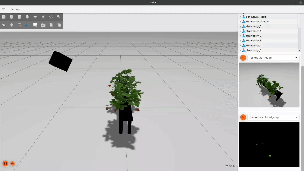
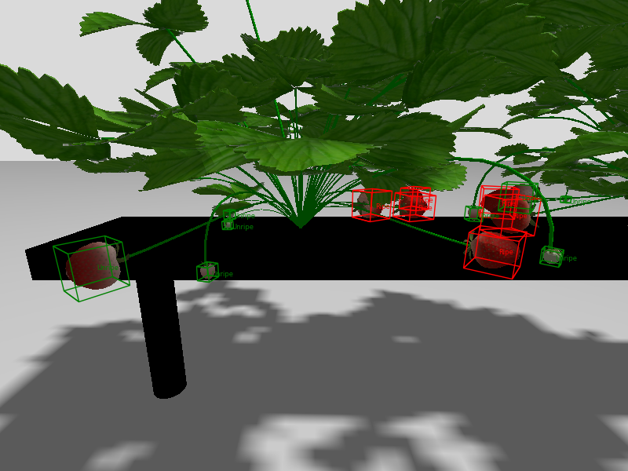

# Straw6D

## About The Project

This repository provides a synthetic dataset for 6DoF pose and 3D size estimation of strawberries. It was generated in Ignition Gazebo simulator: (a) Each generated strawberry is random, encompassing variations in plant shape, the distribution of strawberries on the plant, and the size, ripeness, and pose of the strawberries. (b) For each batch of strawberries, different lighting conditions are set to mimic natural lighting variations. (c) The camera randomly selects angles from a reasonable range to capture images. (d) For a given camera angle, the distance between the camera and the strawberries is also adjusted.

The final dataset, named Straw6D, includes RGB images, depth images, 3D bounding box annotations, strawberry instance segmentation masks and point clouds.

## Usage

## View the Straw6D dataset

python3 visual_datast.py

